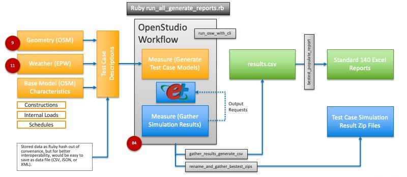

Building Energy Simulation Test - Generation Simulation and Reporting (BESTEST-GSR)
=============

### Table of Contents
- [Purpose of Repository](#purpose-of-repository) 
- [Supported Tools](#supported-tools) 
- [Dependencies](#dependencies) 
- [Steps to Run BESTEST Test Cases and Generate Submission Spreadsheets](#steps-to-run-bestest-test-cases-and-generate-submission-spreadsheets) 
- [Workflow Details](#workflow-details) 
- [Measures](#measures) 
- [Integration Testing Files](#integration-testing-files) 
- [Results](#results) 
- [Next Steps](#next-steps) 

### Purpose of Repository

The purpose of this repository is to generate BESTEST test case models, run simulations, and populate data for ASHRAE Standard 140 reporting spreadsheets for EnergyPlus based whole building simulation tools.

### Supported Tools

The default IDF generation is based on the OpenStudio CLI, but the workflow supports a '[Bring your own IDF](integration_testing/workflow/600EN_from_idf/workflow.osw)' use case. Additionally, for non-EnergyPlus based tools the post processing scripts can be used if simulation results are provided as a CSV file.The scripts on this repository should work on Mac, Windows, and Linux.

### Dependencies

* Install [OpenStudio 3.3.0](https://www.openstudio.net/downloads)
    * make sure command line can recognize the 'openstudio' command
* Install [Ruby](https://www.ruby-lang.org/en/) on your system if it isn't already setup.
    * 2.7 is used for development but other versions may work
    * Since OpenStudio has its own embedded Ruby, which is used for running measures, you don't necessarily have to use a version of Ruby supported by OpenStudio.
* Install [RubyXL](https://rubygems.org/gems/rubyXL) Ruby gem
    * This is used to modify Microsoft Excel spreadsheets
* Install [Parallel](https://rubygems.org/gems/parallel/versions/1.11.2) Ruby gem
    * This allows the CLI to run simulations in parallel

### Steps to Run BESTEST Test Cases and Generate Submission Spreadsheets

* Run the `ruby run_all_generate_reports.rb` script from the command line  while in the top level of the repository.
    * This should generate IDF files, run simulations, and populate copies of Excel files.
* View resulting files
    * The Summary Excel files are saved to the 'results' directory.
        * 'RESULTS5-#.xlsx' and 'RESULTS5-#_OS.xlsx' have the same content
    * zip file for each datapoint are saved to 'results/bestest_zips'
    * A CSV file is saved to "historical" directory with a name unique too this release that is not overwritten in the future.
        * Currently an Excel file with aggregated historical data is saved manually to look at at changes from one release of a tool to the next.

*The image above gives an overview of the proess automated by the `run_all_generate_reports.rb` script.*

### Workflow Details

Currently not all ASHRAE Standard 140-2014 test cases are made. Only test cases required for 179D are created. The following sections are modeled. Under each section is a list of measures, and the Excel file that high level results are created for.
    
* **Section 5.2 (Building Thermal Envelope and Fabric Load Tests) except for Section 5.2.4 (Ground Coupling)**
    * model measure - bestest_building_thermal_envelope_and_fabric_load_tests
    * reporting measure - bestest_building_thermal_envelope_and_fabric_load_reports
        * creating annual bins by temperature from hourly data for ff_temp_bins_section method
        * compiling min, max, and average values as needed for ff_temp_bins_section method
        * add `runner.registerValue` for any data needed later in Excel spreadsheet
    * Std. 140 XLSX - RESULTS5-2A.xlsx
* **Section 5.3 (Space Cooling Equipment Performance Tests)**
    * model measure - bestest_space_cooling_equipment_performance_tests
    * reporting measure - bestest_ce_reporting
        * Calculating COP (mean_cop) using Unitary System Total Cooling Rate and Air System Electric Energy
        * Calculating COP2 (mean_cop_2 and cop_2_24) using Cooling Coil Total Cooling Rate and Air System DX Cooling Coil Electric Energy
        * compiling min, max, and average values as needed
        * add `runner.registerValue` for any data needed later in Excel spreadsheet
    * Std. 140 XLSX - RESULTS5-3A.xlsx and RESULTS5-3B.xlsx
* **Section 5.4 (Space Heating Equipment Performance Test)**
    * model measure - bestest_space_heating_equipment_performance_tests
    * reporting measure - bestest_he_reporting
        * Calculating average average_fuel_consumption in m^3/sec using formula from section 6.4.1.3
        * add `runner.registerValue` for any data needed later in Excel spreadsheet
    * Std. 140 XLSX - RESULTS5-4.xlsx
    
### Measures
 
The measures are contained in the "measures" directory at the top level of the repository. These are used by workflows. to generate test cases or to gather necessary simulation results.

##### Running the measures
* Each measure has one or more unit tests
* Measures are run using the OpenStudio CLI and the 'data_point.osw' files described in the 'Workflow' section.

##### Files used by the Model measures
* `measure.rb` is the main file that drives the measures. It contains logic to building the model beyond what is included in the tables described below.
* The `resources` folder within some measures contains a variety of files used by the measures.
    * There is a library of 9 OSM files that contains geometry, schedules, constructions, and materials. Measures clone these into the seed model. They are named `Bestest_Geo_#.osm`.
    * There is a library of 11  EPW files. The measure will assign different EPW files for different test cases
      * There is also an `epw.rb` file used in support of setting up weather file and location.
    * `besttest_case_var_lib.rb` contains data to create a set of variable values from the case number. 
        * Below is a list of tables that are used to create this data.
            * Table B1-1
            * Table B1-2
            * Table B1-5
            * Table B1-7
            * Table B1-8
        * Primary methods
          * bestest_5_2_3_case_lookup
          * bestest_5_3_case_lookup
          * bestest_5_4_case_lookup
    * `besttest_model_methods.rb` contains additional methods not contained in `measure.rb`.
      * set_opqaue_surface_properties
      * add_output_variable
      * config_sim_settings
      * create_he_system
      * create_ce_system
    * `bestest_resources.osm` contains constructions, schedules, and internal loads used for the test cases. Some may be altered or dynamically generated as needed.
* The `tests` folder contains a Ruby script to run unit test as well as a seed OSM used by the unit tests.
* the `report.html` file generated by some measures can be ignored, the relevant data is saved into the `out.osw` using `runner.registerValue` objects.
    * The envelope reporting measure has some content in the HTML that was used for measure development, but it not used at all in this workflow.

##### Model articulation steps
* besttest_case_var_lib.rb is loaded
* Case number is mapped to set of variables
* Adjust simulation settings
* Assign EPW file
* Lookup and load envelope, and make adjustments as needed
* Load bestest_resources.osm.
    * This is a global resource file for all non geometry OSM resources.
* Add construction sets and alter constructions
* Gather schedules that may be required.
* Add internal loads
* Add infiltration
* Add thermostats
* Add HVAC
* Rename the building
* Add output variable requests (These are added by the reporting measure prior to simulation)
 
### Integration Testing Files

#### Workflow

There is a subdirectory under `integratio_testing/workflow` for each BESTEST test case. Each directory has a unique 'data_flow.osw' file that used to generate the OSM, IDF file, and the simulation results. See link for documentation on the OpenStudio CLI. http://nrel.github.io/OpenStudio-user-documentation/reference/command_line_interface/

There are 84 test case that start with `BESTEST Case ...`. There are two sample workflows in the 'workflow' directory, both generate test case 600EN. One articulates the model with OpenStudio and runs an OpenStudio reporting measure. The other imports an externally generated IDF file and run the same OpenStudio reporting measure as the osm generated test case. The only change the reporting measure makes to the IDF is to inject output variable requests needed by the reporting measure. The IDF file for the "Bring your own IDF" example comes from the `workflow_resources` directory.

Below is a list of files that are generated when the CLI is used to run an OSW.
* data_point.osw is the only file currently committed ot the repository. The file identifies the seed model, weather file, location of measures and other resources, and the workflow steps that are defined. It can be viewed and edited with a text editor.
* The run directory contains the final OSM, IDF, and simulation results from EnergyPlus.
* The reports directory contains html files generated by reporting measures or EnergyPlus.
* `out.osw` is generated after running a simulation with the CLI. It is a copy of 'data_point.osw' overloaded with logging from the measure and simulation runs. The data in 'step_values' is populated by `runner.registerValues` and are used to populate the `results.csv` file that summarizes the results of all of the test cases.
* If you run the BESTEST test cases using `run_all_generate_reports.rb` it will clean out these directories after using what it needs. You can comment out the script lines that do this, or you can manually run an OSW with the CLI if you want to inspect files not found in the zip file.

THe script named `gather_results_generate_csv.rb` steps through each `out,.osw` file and gatheres all the data that is needed for the spreadsheet and saves it in a file named `workflow_results.csv` in the `results` directory outside of `integration_testing`. 

Note: the current reporting measures are setup for a specific system configuration, and in some cases, are expecting objects of specific names. If externally generated IDF files don't match the expected structure and names then the reporting measures, or a copy of it, will need to be altered. The reporting measures could be made more robust so they don't rely on specific names, and support multiple possible system configurations.
 
### Results
The 'results' folder at the top of the repository is used to populate the `YourData` tab of the ASHRAE Standard 140-2014 XLSX files. The spreadsheet is setup to display this data on all of the charts.

##### Files in 'results' folder.
* The is a file named `workflow_results.csv` files with `runner.RegisterValue` data are copied here from the `out.osw` files from individual test cases.
* Zip file with detailed results for each testcase are saved in `bestest_zips` folder. This is not committed ot the repository to keep the check size smaller. Zip files from current and prior releases of are available on [Amazon S3](http://besttest-gsr.s3-website-us-west-2.amazonaws.com/?prefix=). 
* There are three `bestest_populate_report.rb` scrips to generate the populated Excel file for each of the three sections (Envelope, Cooling, Heating).
* The `resources` folder contains raw Excel files from ASHRAE Standard 140-2014.
  * The `common_info.rb` file under `resoucres` contains organization and release specicific information that gets injected into the final Excel files. This should be updated before the script is run to generate new Excel files. 
* Copies of these Excel files are created at the top of the `results` folder. There are four files here because the Cooling script generates two Excel files.
* There is an extra copy of each resulting Excel file with "_OS" at the end of the name. These contain the same results but have program information for OpenStudio instead of EnergyPlus.
* There is a directory named `historical` that contains csv files with two columns that archive all of the data inputs that go to the YourData worksheet in the BESTEST template files. Each release has a version of this for envelope, heating, and cooling. These are automatically generated by the workflow. There is also a manually maintained Excel File named `OpenStudio_BESTEST_historical.xlsx` that allows me to look at delta between current and previous release for each input. It provides a quick way to inspect changes in simulation outputs between releases. 

##### How the reporting post processing script works.
* Raw Excel File opened and copied.
* CSV results loaded and converted to a hash.
* Data from results hash is used to edit the copied Excel file.
* Excel file is saved when changes are done.
* This should be run again anytime simulations are re-ran. `run_all_generate_reports.rb` will do this for you.
* The script is setup to run from the `results` directory.

### Next Steps

* Add to EnergyPlus integration testing
    * Branches can be checked for unexpected changes in BESTEST results
* Extend tests to additional ASHRAE Standard 140-2014 sections beyond 179D requirements.
* Better multiple organization support. Specifically make it easier to maintain running tests across multiple modeling tools from different organizations.
    * Each organization would be responsible for running their own tests, but  as much as the code base as possible can be shared and maintained together.
* Publish high level results to something more dynamic than Excel. Specific interests outlined below.
    * Create reporting with most current version of all tools shown at the same time.
        * This repository is specifically setup for EnergyPlus tools, but this task could fall outside of this repository to support all 179d submissions, with a goal that current versions of high level data for different tools is easily accessible by the modeling community.
    * Create reporting of the most current version of a tool against some number of prior releases of the same tool.
* Automate processing and evaluation of historical data against expected results.
